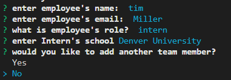

# Team profile generator

# Express: Employee tracker

## Table of Contents

* [Description](#description)
* [Links](#links)
* [Screenshots](#screenshots)
* [Installation](#installation)
* [Usage](#usage)
* [Technologies Used](#technologies)
* [Questions](#questions)

## Description

A node application that uses inquirer to prompt the user for information about their project team. Then htmlpage with employee information is dynamicaly updated with the information the user provided. 

## Links

[View a Video Demonstration](https://drive.google.com/file/d/1pZe9rv7e_biqpArJgBVZpk54LglbVVnp/view)

## Screenshots

## Installation Instructions

* run "npm run install" in terminal to get package-lock.json and node_modules
* run prompt with "node app.js"

## Usage

in the command line, run "node app.js" you will be prompted on what you would like to do with questions about your team. You will provide the infromation about the manager first, then you can add employees and interns and their information. Once you have added all of your team members the "teamPage.html" file in the output folder of the directory will be updated with the information you provided. This process can be repeated mulitple times making it an efficent way to make a profile of your team members and thier roles. 
 

## Technologies Used

node, express, inquirer, mysql

## Questions

If you have further projects and questions, you can find me on Github: [GITHUB](https://github.com/benimahat1291). 
please visit my portfolio to find contact information: [BENI MAHAT](https://benimahat1291.github.io/Portfolio_v2/#/). 

